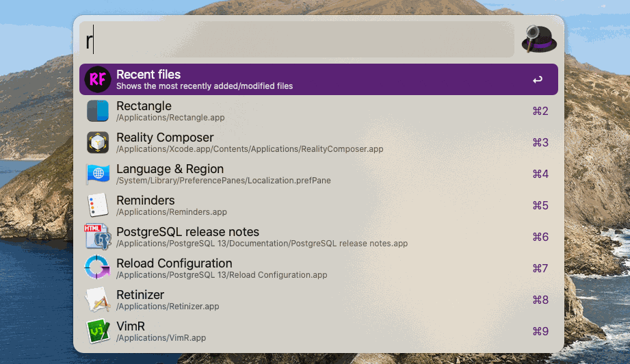

# **Recent Files**

## Overview

**Recent Files** is an [Alfred](https://www.alfredapp.com) workflow that displays a list of recently added/modified files, newest first, in Alfred's file browser.

The Python script **recent_files**, which does the work behind the workflow, may also be used as a standalone command-line utility; when used as a command-line utility, **recent_files** sends the list of files to standard output.

***NOTE***: **Recent Files** was developed on and for macOS. It has not been tested on any other operating system, and the following documentation is written from the perspective of a macOS user.



## Prerequisites

### Alfred Powerpack

You must have [Alfred's Powerpack](https://www.alfredapp.com/powerpack/) installed in order to use **Recent Files** as an Alfred workflow.

### fd

In addition, the `fd` command is required to run both the **Recent Files** workflow and the **recent_files** command-line utility. Both the **Recent Files** workflow and the **recent_files** command-line utility will attempt to use the `fd` command that is present in your `$PATH`.

It's possible to confirm that `fd` is installed by entering the following commands in a Terminal window:

`which fd`

If the message *fd not found* is displayed it will be necessary to install it in order to use **Recent Files**/**recent_files**. `fd` can be installed from a variety of sources, including:

* [MacPorts](https://www.macports.org/)
* [Brew](https://brew.sh/)
* [GitHub](https://github.com/sharkdp/fd)

### Python 3

**Recent Files** and **recent_files** require Python 3.8; earlier 3.x versions of Python may work, but have not been tested.

It's possible to confirm that `python3` is installed by entering the following commands in a Terminal window:

`which python3`

If the message *python3 not found* is displayed it will be necessary to install Python in order to use **Recent Files**/**recent_files**.

Python 3.x may be installed using any of the following:

* [MacPorts](https://www.macports.org/)
* [Brew](https://brew.sh/)
* [Direct download from Python.org](https://www.python.org/downloads/)

## **Recent Files**, the Alfred workflow

### Installation

Download the workflow file and double-click on it to install it. During installation Alfred will display the [Workflow Configuration](#Workflow-Configuration) values screen.

### Usage

`rf` — Invoke **Recent Files**

After invocation, **Recent Files** will display the list of results in Alfred where any allowed action (open/move/delete/preview, etc.) may be performed. By default, this search starts at the user's `$HOME` directory—although this can be changed, see [Workflow Configuration](#Workflow-Configuration)—and includes files in subdirectories.

### Workflow Configuration

The behavior of **Recent Files** may be configured by selecting the workflow and clicking on the `Configure Workflow` button in Alfred. Here are the values that can changed from that screen:

|Variable|Default value|Description|
|---------|--------|--------|
|`keyword`|rf|Keyword to invoke **Recent Files** from Alfred.|
|`FD_COMMAND`|fd|Path to the `fd` command. By default, the workflow will use the `fd` found in the `$PATH` variable.|
|`TOP_LEVEL_DIRECTORY`|~|Top level directory to search from. The ~ (tilde) specifies the user's `$HOME` directory.|
|`IGNORE_FILE`|`example_ignore_file.txt`|File to use as an ignore file; see [Ignore Files](#Ignore-Files).|
|`FILETYPE`|f|This can be set to either **Files only**, **Directories only**, or to **Both files and directories**.|
|`EXTENSIONS`|:|One or more colon-separated file/directory extensions, such as `pdf`, `md`, etc. Dots are not required.|
|`CHANGED_WITHIN`|7d|Show items added/changed within a time period. The default is `7d` (seven days); other units may be used, such as min (minutes), h (hours), and w (weeks). A value of `12h`, for example, would only return files created or modified the previous 12 hours.|
|`MAX_RESULTS`|20|Maximum number of results to display in Alfred.|
|`JSON_DIR_TITLE`|name|If set to **name**, display only the name of the directory as the title (first line) of results. If set to **path**, display the full path to the directory as the title of the results. The subtitle will always display the full **path** to the directory. (Using **name** is less visually cluttered--and more consistent with Alfred's display style.)|
|`JSON_FILE_TITLE`|name|If set to **name**, display only the name of the file as the title (first line) of results. If set to **path**, display the full path to the file as the title of the results. The subtitle will always display the full **path** to the file. (Using **name** is less visually cluttered--and more consistent with Alfred's display style.)|
|`FOLLOW_LINKS`|Ignore|If set to **Ignore**, searches will not traverse symbolically linked directories. If set to **Follow**, symbolically linked directories will be searched for results. Note that it's possible to create a directory structure using symbolic links that would cause the display of duplicate results.|
|`SHOW_HIDDEN`|Ignore|If set to **Ignore**, hidden files (files beginning with the dot ('.') character) will not be displayed. If set to **Show**, hidden files will be displayed in results. Note that if this option is set to **Show** it's possible to display results that would have been ignored by the `IGNORE_FILE`, as the `IGNORE_FILE` has lower precedence to the `fd` command than the hidden files option.|

## **recent_files**, the command-line utility

The **Recent Files** Alfred workflow uses a Python 3 script, **recent_files**, to perform the search. **recent_files** can be used as a standalone command-line utility to display a list of recently-modified files to standard output (stdout).

### Installation

To use **recent_files** as a standalone utility, copy it to a directory in your `$PATH`, such as `~/bin` or wherever user scripts are located.

### Command-line usage

When invoked with `-h`, the following usage message is displayed:

```
usage: recent_files [-h] [-c CHANGED_WITHIN] [-d DIRS] [-e EXTS]
                    [--fd-command FD_COMMAND] [-H] [-i IGNORE_FILE]
                    [--json-dir-title {name,path}]
                    [--json-file-title {name,path}] [-L] [-m MAX_RESULTS]
                    [-o {text,json}] [--reverse] [-t FILETYPES]

Finds recent files

options:
  -h, --help            show this help message and exit
  -c CHANGED_WITHIN, --changed-within CHANGED_WITHIN
                        changed within 1h, 2d, 5min, etc.; the default is 7d
  -d DIRS, --dir DIRS   the directory/directories to search (multiple -d
                        arguments are allowed); the default is the current
                        directory
  -e EXTS, --extension EXTS
                        file extensions to search (multiple -e arguments are
                        allowed); the default is to search all file/directory
                        extensions
  --fd-command FD_COMMAND
                        path to the fd(1) command if not specified in $PATH
  -H, --hidden          show hidden files; the default is not to show hidden
                        files
  -i IGNORE_FILE, --ignore-file IGNORE_FILE
                        path to the Git-format ignore file for search
                        exclusions, optional
  --json-dir-title {name,path}
                        in JSON (only), display only the directory name as
                        title; 'path' displays the full pathname to the
                        directory
  --json-file-title {name,path}
                        in JSON (only), display only the filename as title;
                        'path' displays the full pathname
  -L, --follow-links    Traverse symbolically linked directories; default is
                        to ignore them
  -m MAX_RESULTS, --max-results MAX_RESULTS
                        only return MAX_RESULTS items; the default is to
                        return all results
  -o {text,json}, --output-format {text,json}
                        output format, default is text; json is for use by
                        Alfred
  --reverse             reverse the sorting order; the default is newest files
                        first
  -t FILETYPES, --filetype FILETYPES
                        filetype, as supported by fd; the default is "f"; the
                        argument may be repeated or combined, so both (1) and
                        (2) are allowed: (1) --filetype fd (2) --filetype f
                        --filetype d
```

Note that several of these options are intended for the **Recent Files** Alfred workflow and are probably not useful for command line usage, including `-o`, `--json-dir-title`, and `--json-file-title`.

### Command-line examples

List all files modified within the past day:

`recent_files --changed-within 1d`

List files and directories modified within the past three days:

`recent_files --changed-within 3d --filetype fd`

List files modified in the past week, in the Documents directory and subdirectories:

`recent_files -c 1w --dir ~/Documents`

List `pdf`, `md`, and `txt` files modified in the past day, in the Documents directory and subdirectories (the two commands are equivalent):

`recent_files -c 1d -e pdf --extension md -e txt --dir ~/Documents`

`recent_files -c 1d -e pdf:md:txt --dir ~/Documents`

List files modified in the past week, in the Documents directory, the Downloads directory, and their subdirectories (the two commands are equivalent):

`recent_files -c 1w --dir ~/Documents --dir ~/Downloads`

`recent_files -c 1w --dir '~/Documents:~/Downloads'`

Note that in the second example above single quotes were used to protect the argument to `--dir`; this is especially important if the path contains spaces or shell metacharacters.

List files modified in the past hour, including hidden files:

`recent_files -c 1h -H`

List files modified in the past hour, including files in symbolically linked subdirectories:

`recent_files -c 1h -L`

Use a custom ignore file and display results in reverse order (oldest item first):

`recent_files --ignore-file ~/my_ignore_file --reverse`

Specify a different location for the fd command:

`recent_files --fd-command /some/path/to/fd/command`

## Ignore Files

Both the **Recent Files** workflow and the **recent_files** command-line utility can use a Git-style ignore file. This is used to filter extraneous files from the results.

This is what the provided ignore file contains:

```
Library
Icon?
~*
*.photoslibrary
*.musiclibrary
*.tvlibrary
```

This ignore file will cause `fd` to ignore files in the Library folder, Icon files with embedded carriage returns, files beginning with the '~' character (often used for temporary files), and files with `.photoslibrary`, `.musiclibrary`, and `.tvlibrary` extensions. Files matched in an ignore file will not be returned as results unless another option (such as `-H`) takes precedence.

If this file was named `my_ignore_file` and put in the `$HOME` directory, the following command line would allow **recent_files** to use it:

`recent_files --ignore-file $HOME/my_ignore_file`

Note that an empty, 0-length file is a valid ignore file. While this may not be useful for the **recent_files** command-line (since one could simply omit the `-i/--ignore-file` argument) this might be desirable when using the **Recent Files** workflow to return all results without any filtering.

## JSON output for Alfred

**recent_files** produces JSON output format as specified by Alfred. It's unlikely to be useful when using the command-line interface, but this capability is necessary for the **Recent Files** workflow to function correctly.

See [Script Filter JSON Format](https://www.alfredapp.com/help/workflows/inputs/script-filter/json/) for more, but here's the basic structure:

```
{
  "items": [
    {
      "type": "file",
      "title": "foo.txt",
      "subtitle": "/Users/testuser/Documents/foo.txt",
      "arg": "/Users/testuser/Documents/foo.txt",
      "icon": {
        "type": "fileicon",
        "path": "/Users/testuser/Documents/foo.txt"
      }
    },
    {
      "type": "file",
      "title": "bar.txt",
      "arg": "/Users/testuser/Documents/bar.txt"
      "subtitle": "/Users/testuser/Documents/bar.txt",
      "icon": {
        "type": "fileicon",
        "path": "/Users/testuser/Documents/bar.txt"
      }
    }
  ]
}
```

Note that **recent_files** does not populate the **uid** and **autocomplete** properties used by Alfred.

## Tips on changing search results and speeding up the search

If **Recent Files**/**recent_files** isn't doing what you need, consider some of the following options:

### Change the default changed within time period

Expanding the time period from the default of 7 days will increase the number of results returned (potentially at the expense of performance), while shrinking the time period will reduce the number of results returned (and perhaps improve performance).

See the [Workflow Configuration](#Workflow-Configuration) section for information on changing the `CHANGED_WITHIN` value in the **Recent Files** workflow.

For the **recent_files** command-line utility, do the following:

Add a `--changed-within` argument to the command line to increase or decrease the default time period to search.

### Add a custom ignore file

A custom ignore file is the best way to filter out unwanted results.

See the [Workflow Configuration](#Workflow-Configuration) section for information on changing the `IGNORE_FILE` value in the **Recent Files** workflow.

For the **recent_files** command-line utility, do the following:

Add the `--ignore-file` argument to the command. See [Ignore Files](#Ignore-Files).

### Use multiple directories in the search

It's sometimes easier to specify the directories to include for searches than it is to filter out directories via [Ignore Files](#Ignore-Files).

These commands are equivalent:

```
recent_files -c 1w --dir ~/Documents --dir ~/Downloads --dir $HOME/Pictures
# OR
recent_files -c 1w --dir '~/Documents:~/Downloads:$HOME/Pictures'
```

The second version (using the colon-separated list of directories) may also be used in the [Workflow Configuration](#Workflow-Configuration) for the **Recent Files** workflow.

Note that any environment variable referenced must be defined; this is straightforward when using **recent_files** from the command line, but it's trickier when using the **Recent Files** workflow. ($HOME is a special case that should be defined at all times.) See [Understanding the Scripting Environment](https://www.alfredapp.com/help/workflows/advanced/understanding-scripting-environment/) for an introduction to the issue.

### Limit the number of returned results

See the [Workflow Configuration](#Workflow-Configuration) section for information on changing the `MAX_RESULTS` value in the **Recent Files** workflow.

For the **recent_files** command-line utility, do the following:

Add the `--max-results` argument. While this won't increase the performance of the search itself, it will reduce the number of files displayed, which may prevent the list of files from being overly large.

### Change the top-level directory

Changing the default top-level directory from `$HOME` to another directory—such as `$HOME/Documents`—is another way to return results faster, as it will eliminate many files from consideration.

See the [Workflow Configuration](#Workflow-Configuration) section for information on changing the `TOP_LEVEL_DIRECTORY` value in the **Recent Files** workflow.

For the **recent_files** command-line utility, do the following:

Add one or more `--directory` arguments to the command.

### See only files/directories with specific extensions

Add one or more `-e/--extension` arguments to the command. A single, colon-separated argument may be used as well, so `--extension pdf:md:html` is equivalent to `-e pdf --extension md -e html`.

## Acknowledgements

This workflow was inspired by Hans Raaf's Alfred workflow, [*Last changed files*](https://github.com/oderwat/alfredworkflows).

Thanks to @vitorgalvao for multiple enhancement suggestions. Recent changes, including the `-L` option, processing multiple colon-separated directories, and the changes to the **Recent Files** workflow default display are the result of issues and discussions with @chumido and @saeedesmaili--thanks to both of them.

The `-e/--extension` argument, as well as the addition of different Action Modifiers in the Alfred workflow, were prompted by discussions with @NicholasSloan--thanks Nick!

## Copyright

All code/media is released under the [MIT License](https://opensource.org/licenses/MIT)
